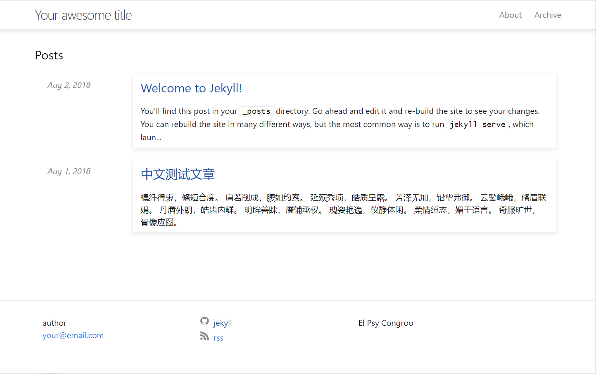

# jekyll-theme-ink

This is a simple jekyll theme based on [minima](https://github.com/jekyll/minima).

Preview [demo](https://kemingy.github.io/jekyll-theme-ink/)



## Feature

- [x] Archive with categories
- [x] MathJax
- [x] Google Analystics
- [x] SEO with jekyll-seo-tag
- [x] RSS
- [x] Sitemap
- [x] Adapt mobile

`jekyll-archives` is not supported by GitHub Pages [PR](https://github.com/github/pages-gem/pull/106). You need to build it yourself if you want to use this. You can use Travis CI to do this for you. [Tutorial](https://gist.github.com/kemingy/776ccc839b28c0e8c0f867cddabb0b8e)

## Usage

### Social account

Social account can be set in your `_config.yml` file. This will be shown in the footer of page.

### Header Link

Any file except `404` in root folder will be add to header, like `about.md` and `archive.html`.

### Google Analytics

Set your `google_analytics` UA in `_config.yml`.

### Math

Use `$\alpha$` for inline formula and `$$\Sigma$$` for outline formula.


## Installation

Add this line to your Jekyll site's `Gemfile`:

```ruby
gem "jekyll-theme-ink"
```

And add this line to your Jekyll site's `_config.yml`:

```yaml
theme: jekyll-theme-ink
```

And then execute:

    $ bundle

Or install it yourself as:

    $ gem install jekyll-theme-ink

## Usage

TODO: Write usage instructions here. Describe your available layouts, includes, sass and/or assets.

## Contributing

Bug reports and pull requests are welcome on GitHub at https://github.com/[USERNAME]/hello. This project is intended to be a safe, welcoming space for collaboration, and contributors are expected to adhere to the [Contributor Covenant](http://contributor-covenant.org) code of conduct.

## Development

To set up your environment to develop this theme, run `bundle install`.

Your theme is setup just like a normal Jekyll site! To test your theme, run `bundle exec jekyll serve` and open your browser at `http://localhost:4000`. This starts a Jekyll server using your theme. Add pages, documents, data, etc. like normal to test your theme's contents. As you make modifications to your theme and to your content, your site will regenerate and you should see the changes in the browser after a refresh, just like normal.

When your theme is released, only the files in `_layouts`, `_includes`, `_sass` and `assets` tracked with Git will be bundled.
To add a custom directory to your theme-gem, please edit the regexp in `jekyll-theme-ink.gemspec` accordingly.

## License

The theme is available as open source under the terms of the [MIT License](https://opensource.org/licenses/MIT).

